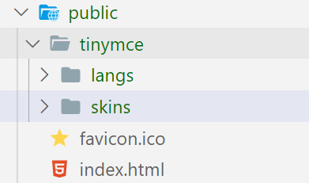
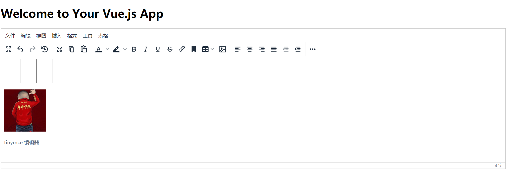
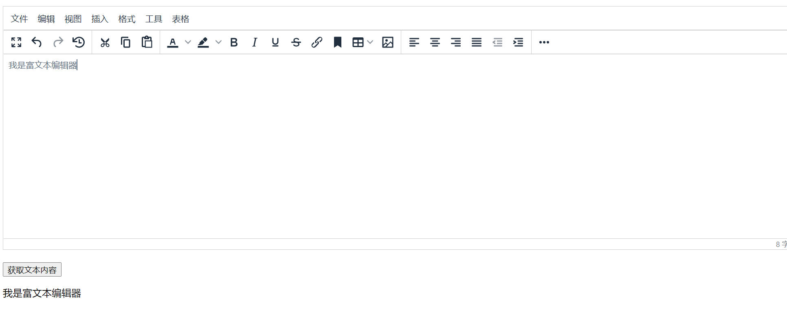

# vue3-tinymce

## Project setup

1. yarn install
2. yarn serve


## 安装和配置tinymce

```js
1. yarn add tinymce -S
2. yarn add @tinymce/tinymce-vue -S
3. 前往此地址下载中文汉化包： https://www.tiny.cloud/get-tiny/language-packages/

```


```js
4. 解压汉化包，拿到langs文件夹，放到项目 public/tinymce下（tinymce需要自己创建）
5. 将nodeModules/tinymce 下的skins文件夹复制到项目 public/tinymce下
```




##### 【详细配置文件 请看代码 src/components/myEditor】

#### 效果如下：




